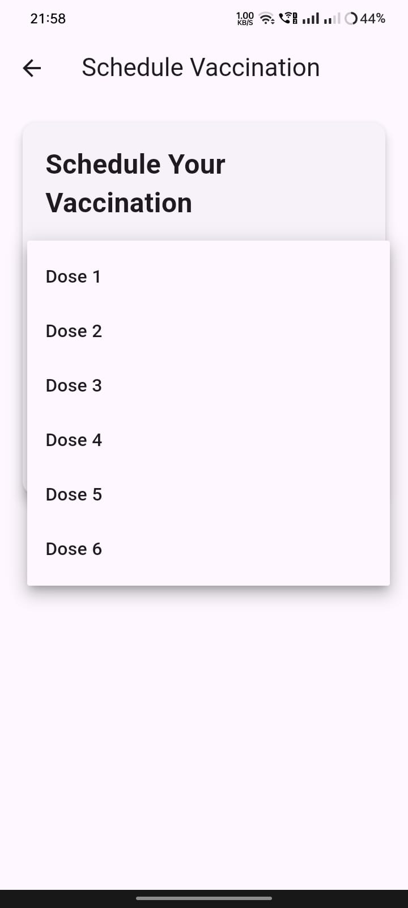

# babycare

Baby Care For Children Vaccination And Nutritional Guidance
SignUp Page: The SignUp page allows new users to create an account by entering a valid email and password. Upon submission, the system securely stores these credentials in the database. Once the account is created, the user is directed to the home page, where they can start interacting with the app’s features. This process provides a seamless transition from registration to active usage, enabling users to manage their children's vaccination records efficiently. If the user already has an account, they can click on the "Sign In" link to go back to the SignIn page.

.jpeg)

SignIn Page: The SignIn page is designed to authenticate users by requesting their registered email and password. When users input their credentials, the system checks if they match the stored data in the database. If the credentials are correct, the user is securely logged in and granted access to the home page, ensuring a personalized and secure experience. If the credentials are incorrect, the user will be notified, allowing them to retry the login process. If the user is new and does not have an account, they can click on the "Create Account" link to proceed to the SignUp page.

Reset Password Page: On the Reset Password page, users are prompted to enter their registered email address. Once they submit the email, they can click on the "Send Reset Link" button. A reset link will then be sent to their email address, allowing them to securely reset their password and regain access to their account. This page is accessible by clicking on the "Forgot Password" link below the SignIn page, which redirects users to the Reset Password page.

Home Page: The Home Page displays a comprehensive table of all the vaccination schedules for the children. On the top left corner, there is a drawer menu that provides easy access to various features of the app. The drawer includes options such as "Schedule Vaccination," "View Schedule," "Diet Recommendations," "Side Effect Prediction," "Profile," and "Sign Out." Additionally, the drawer displays a welcome message with the user login email, creating a personalized experience. This layout ensures users can navigate seamlessly through the app’s features while keeping important vaccination-related information readily available.

Schedule Vaccination: In the Schedule Vaccination section, users can select the appropriate dose from a dropdown menu. Once the dose is selected, the user can choose the date for the vaccination. After setting the dose and date, the user can click on the "Schedule Vaccination" button. Once the button is clicked, a confirmation notification is displayed. Additionally, reminder notifications will be sent to the user's mobile device 5 days before the scheduled vaccination date, as well as on the day of the vaccination, to ensure timely preparation and remind the user of the upcoming vaccination.

View Schedule: In the View Schedule section, users can see a detailed list of all their scheduled vaccinations. The schedule displays essential information such as the dose number, vaccination date, and additional vaccination details. This allows users to keep track of upcoming vaccinations and stay organized with their child's vaccination timeline.

Diet Recommendation: The Diet Recommendation screen helps parents ensure their baby receives proper nutrition for healthy growth. Users can enter the baby's age in weeks and weight in kilograms, then click the "Predict" button to generate a personalized diet plan. The system provides nutritional guidance tailored to the baby's age and weight, offering recommendations to support balanced growth, maintain a healthy weight, and enhance overall well-being.

Side Effect Prediction: In the Side Effect Prediction screen, users can enter the child's age in weeks and select the dose they have received. After providing this information, they can click on the "Predict" button to generate a prediction of possible minor side effects associated with the selected dose. This feature helps users stay informed and prepared for any expected reactions.

